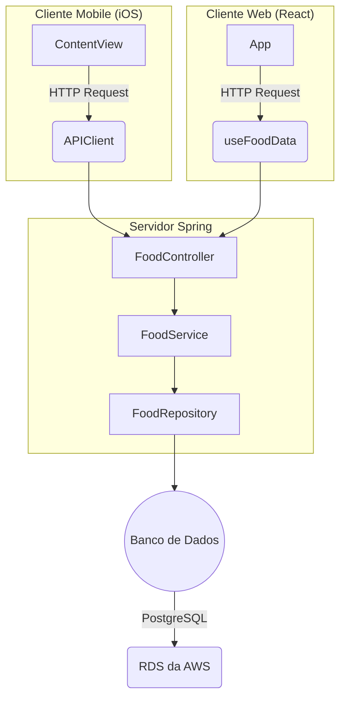

# Cardápio Digital

Este é um exemplo de uma aplicação Spring para um cardápio digital, que permite aos usuários visualizar uma lista de alimentos disponíveis e adicionar novos alimentos ao cardápio.

## Funcionalidades

- Listar alimentos disponíveis no cardápio.
- Adicionar novos alimentos ao cardápio.

## Repositórios complementares

- [Repositório do cliente iOS](https://github.com/luizgolima/fiap-cardapio-digital-ios)
- [Repositório do cliente web](https://github.com/luizgolima/fiap-cardapio-digital-client)

## Aplicações no ar (deploy)
- [Frontend](https://fiap-cardapio-digital-client.onrender.com)
- [Backend](https://fiap-cardapio-digital-server.onrender.com/food)

## Arquitetura

A arquitetura da aplicação segue o seguinte padrão:




## Entidade do Banco de Dados

A entidade do banco de dados é representada pela tabela `foods`, que possui os seguintes campos:

- `id`: Identificador único do alimento (chave primária).
- `title`: Título do alimento.
- `image`: URL da imagem do alimento.
- `price`: Preço do alimento em unidades monetárias.

### Requisitos
- JDK (Java Development Kit) 17
- Maven

## Instalação e Execução Local
1. Clone este repositório:
   ```bash
   git clone https://github.com/luizgolima/fiap-cardapio-digital-server.git
   ```
2. Acesse o diretório da aplicação:
   ```bash
   cd fiap-cardapio-digital-server
   ```
3. Instale as dependências do Maven:
   ```bash
   mvn install
   ```
4. Execute a aplicação utilizando o Maven:
   ```bash
   mvn spring-boot:run
   ```

